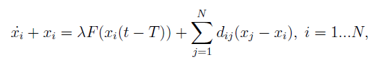
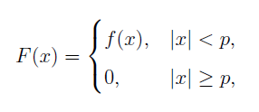
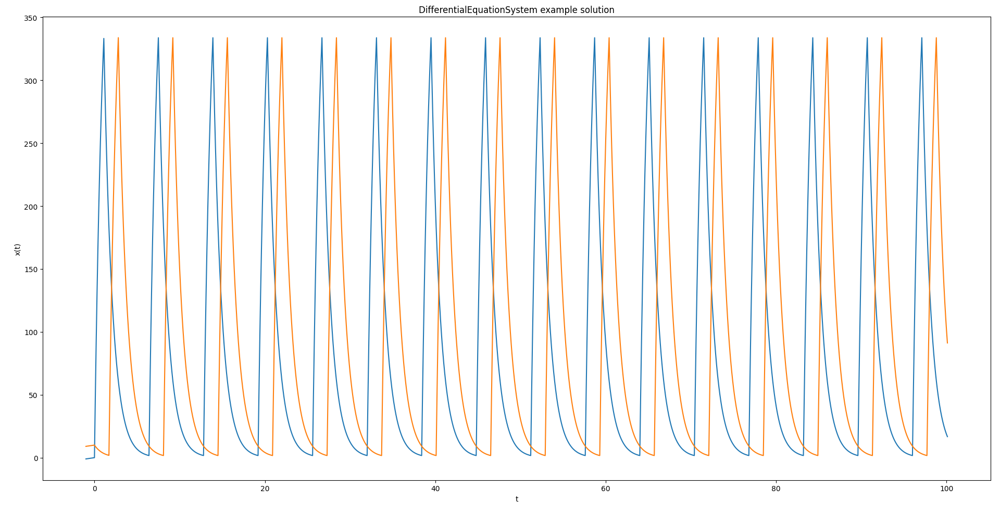
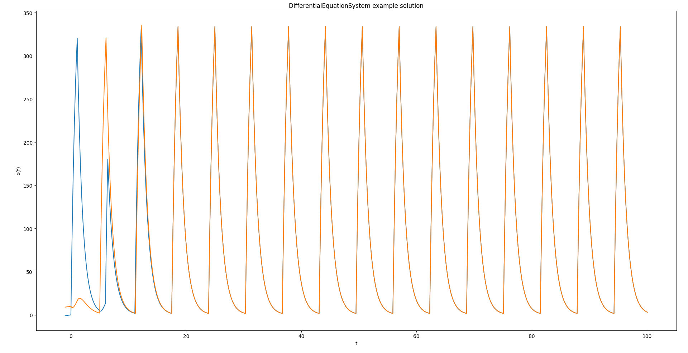

# Програма для численного решения системы дифференциальных уравнений с запаздыванием

Данная програма способна решать системы вида:



где T - время запаздывания, \Lambda - большой параметр, d_{i,j} - сила связи между i-ым и j-ым уравнениями в системе. Функция F(x) представляет собой финитную функцию вида:



Решение ищется методом Рунге-Кутта, реализованого на С++. Интерфейс для использования проброшен в python библиотеку differential_eq_py.

Основной класс для решения DifferentialEquationSystem принимает следующие аргументы конструктора: init_funcs - начальные значения(непрерывные функции, опредленные на отрезке [-T, 0]), h - шаг численного счета, T - время запаздывания, L - параметр \Lambda, relations - матрица связей(d_{i,j}), finit_func - функция f(x) из определения финитной функции.


```python
import matplotlib.pyplot as plt
from differential_eq_py import DifferentialEquationSystem

PARAM_P = 5

def finit(x):
    if -PARAM_P < x < PARAM_P:
        return 5
    return 0

init_funcs = [
    lambda t: t,
    lambda t: t + 10
]

des = DifferentialEquationSystem(init_funcs=init_funcs, 
                                 h=0.1,
                                 T=1,
                                 L=100,
                                 relations=[[0, 0], [0, 0]],
                                 finit_func=finit)
des.Solve(100)
solution = des.GetSolutionData()

plt.title("DifferentialEquationSystem example solution")
plt.xlabel("t")
plt.ylabel("x(t)")

for t, x in solution:
    plt.plot(t, x)

plt.show()
```  



